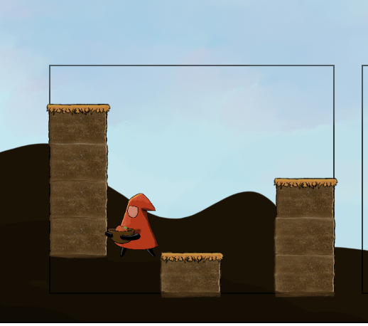
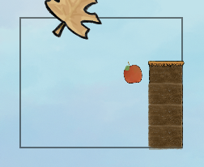
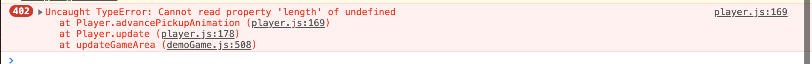

# TODO

Bugs, todos, features.

## Bugs
- [x] Some tiles do not render, which leads to "walking on air."
  Browser: Chrome (macOS)

  
  
  FIXED: Fixed when I made the change that loads all assets only once. Which means this problem had something to do with the timing of loading assets.
- [x] Network requests are being made each frame to fetch all tile images. Disable cache (in Chrome DevTools) shows this.
- [ ] I think the hills are too dark. Should lighten them a little.
- [ ] Sometimes not able to get a "card" to stick. Not sure how to reproduce yet, but I've seen it a few times.
- [x] On Level 2, colliding with apple results in flickering and repeated TypeErrors:
  
  
  Repro: Go to level 2. The bug happens on the tile/card shown above, but you can't "fall" onto the apple. Jump unto the platform without touching the apple, then walk into the apple. Seems to also only happen when using the Restart button. This means that some internal state is not being reset properly.

  FIXED: 99% sure I fixed the issue. Caused by player using the Restart button. The `globals.apples` Set, which kept track of apples that the player had or were on screen--I'm not sure which--, was not being reset. The solution was to call `.clear()` on that set in the `startLevel()` function, which is called when the Restart button is clicked.

## Bug Fixes

* Fix for different screen resolutions. For reference, this is the method we are using for scaling the canvas, based on pixel ratio: https://www.html5rocks.com/en/tutorials/canvas/hidpi/
